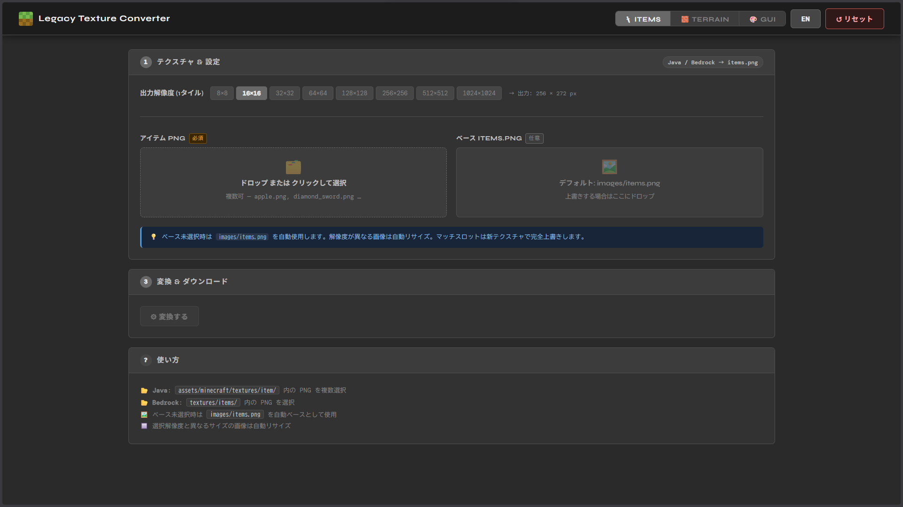

# Legacy Texture Converter

**[🌐 Open Tool / ツールを開く 🌐](https://ignseed.github.io/Legacy-Texture-Converter/)**

[](LICENSE)


**Java / Bedrock エディションのテクスチャパックを Minecraft Legacy Console Edition (LCE) 向けに変換・編集するブラウザツールです。**
A browser-based tool to convert and edit Java/Bedrock texture packs for Minecraft Legacy Console Edition (LCE).



---

## 機能 / Features

### 🗡 Items — アイテムテクスチャ変換

Java / Bedrock の個別アイテムテクスチャ PNG を LCE 形式の `items.png` アトラスに変換します。
Converts individual item texture PNGs (Java/Bedrock) into the LCE `items.png` atlas format.

- 複数ファイルの一括変換 / Batch conversion of multiple files
- 出力タイルサイズを 8×8 〜 1024×1024 から選択 / Output tile size from 8×8 to 1024×1024
- カスタムベース `items.png` の指定に対応 / Supports custom base `items.png`
- 解像度が異なる画像は自動リサイズ / Auto-resizes images with mismatched resolution

### 🧱 Terrain — ブロックテクスチャ変換

ブロックテクスチャ PNG を `terrain.png` および MipMap ファイル 3 種に変換します。
Converts block texture PNGs into `terrain.png`, `terrainMipMapLevel2.png`, and `terrainMipMapLevel3.png`.

- 16×16 / 32×32 タイル解像度に対応 / Supports 16×16 and 32×32 tile resolutions
- MipMap ファイルを自動生成 / Automatically generates MipMap files
- カスタムベース `terrain.png` の指定に対応 / Supports custom base `terrain.png`

### 🎨 GUI — ARC / FUI エディタ

LCE の `.arc` アーカイブを読み込み、内部の `.fui` ファイルを閲覧・編集できます。
Load `.arc` archives from LCE and browse/edit the `.fui` files inside.

- ARC アーカイブの展開・再パック / Extract and repack ARC archives
- FUI ファイル内の画像を閲覧・書き出し / Browse and export images inside FUI files
- 画像の差し替えに対応 (PNG / JPEG) / Replace images with custom PNG/JPEG
- テキストファイル (.txt) のインラインエディタ / Inline editor for .txt files
- 色補正 R↔B スワップ機能 / R↔B color swap for color correction

---

## 使い方 / How to Use

インストール不要。ブラウザで開くだけで動作します。
No installation required — just open in a browser.

### オンライン / Online

**[https://ignseed.github.io/Legacy-Texture-Converter/](https://ignseed.github.io/Legacy-Texture-Converter/)**

### ローカル実行 / Run Locally

```bash
# index.html をブラウザで直接開く / Open index.html directly
# または Python サーバーを使う場合 / or use the Python server:
python Server.py
# → http://localhost:8000 で起動 / opens at http://localhost:8000
```

### テクスチャパック変換の手順 / Pack Conversion Steps

1. **Pack タブ**を選択し、`.zip` または `.mcpack` ファイルをドロップ
   Select the **Pack** tab and drop your `.zip` or `.mcpack` file
2. マッピングプレビューで変換対象テクスチャを確認
   Check the mapping preview to see which textures will be converted
3. 設定モーダルで出力解像度・ベース画像を設定
   Configure output resolution and base image in the settings modal
4. **Convert** ボタンを押すと変換が始まりログが表示される
   Press **Convert** — progress and logs will update in real time
5. `items.png` / `terrain.png` / MipMap ファイルをダウンロード
   Download `items.png`, `terrain.png`, and MipMap files

### GUI 編集の手順 / GUI Editing Steps

1. **GUI タブ**を選択し、LCE の `.arc` ファイルを読み込む
   Select the **GUI** tab and load an LCE `.arc` file
2. ファイルツリーから `.fui` ファイルをクリックして画像を閲覧
   Click a `.fui` file in the tree to view its images
3. 差し替えたい画像を選択し、PNG / JPEG をドロップして置き換える
   Select an image and drop a PNG/JPEG to replace it
4. 変更を適用後、改変済み `.arc` をダウンロード
   Apply changes and download the modified `.arc` file

---

## ファイル構成 / File Structure

```
/
├── index.html                  # メイン UI / Main UI
├── app.js                      # アプリロジック / Application logic
├── style.css                   # スタイル / Styles
├── Server.py                   # ローカルサーバー (任意) / Local server (optional)
└── images/
    ├── items.png               # デフォルトベースアトラス / Default items atlas
    ├── terrain_16x.png         # デフォルトベース (16×16) / Default base (16×16)
    ├── terrain_32x.png         # デフォルトベース (32×32) / Default base (32×32)
    └── thumbnail.png           # OGP サムネイル / OGP thumbnail
```

---

## 対応ブラウザ / Browser Support

モダンブラウザであれば動作します。
Works in all modern browsers.

| Browser | Support |
|---------|---------|
| Chrome | ✅ |
| Firefox | ✅ |
| Edge | ✅ |
| Safari | ✅ |

- Canvas API / File API / Fetch API を使用
- サーバー不要・完全クライアントサイド動作 / No server required — fully client-side
- オフライン動作可 / Works offline after first load

---

## 言語切替 / Language Toggle

ヘッダー右上の `EN` / `JP` ボタンで日本語・英語を切り替えられます。
Use the `EN` / `JP` button in the top-right header to switch between Japanese and English.

---

## 参考リポジトリ / References

このツールは以下のリポジトリを参考に制作しました。
This tool was developed with reference to the following repositories.

| Repository | Description |
|---|---|
| [kzpns/FuiEditor](https://github.com/kzpns/FuiEditor) | FUI ファイルのパース・書き出しロジックの参考 / FUI file parsing and export logic |
| [PhoenixARC/MUArchiveEditor](https://github.com/PhoenixARC/MUArchiveEditor) | ARC アーカイブフォーマットの解析の参考 / ARC archive format analysis |
| [jeremy2206/Java-to-LCE-Texture-Pack-Converter](https://github.com/jeremy2206/Java-to-LCE-Texture-Pack-Converter) | Java → LCE テクスチャ変換のタイルマッピングの参考 / Tile mapping for Java to LCE texture conversion |

---

## ライセンス / License

[MIT License](LICENSE)
